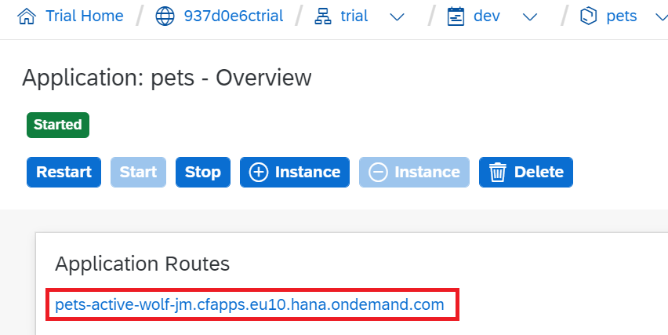
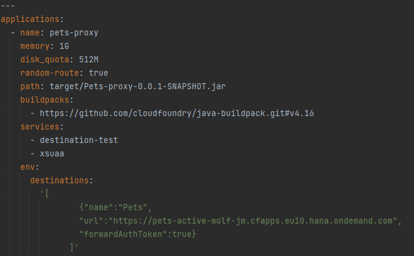
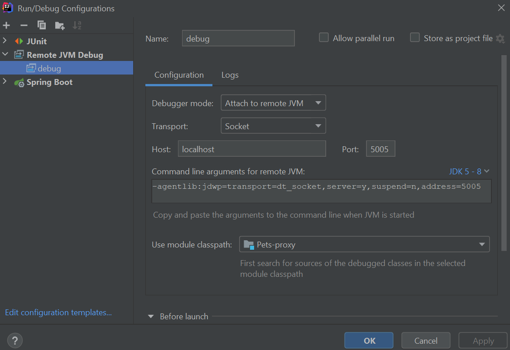
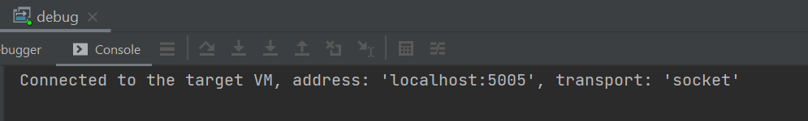
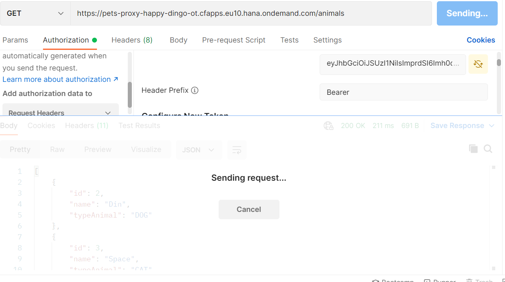
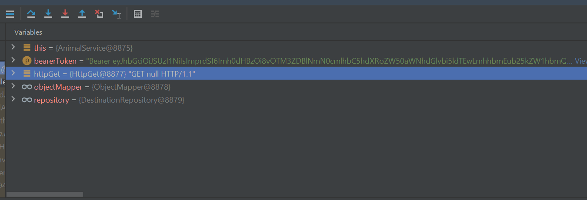

# Pets

## Description

### General description

* A person can have several animals
* Animal can have several owners
* Animals are dogs or cats
* Removing a person leads to the removal of his animals
* Owners can exchange animals

### Maven compile & run commands

```
mvn clean install -P <profile-id>
```  

```
mvn -P<profileId> spring-boot:run
```  

`<profile-id>` it is id of the profile for a build (**dev** or **prod**).

**Example:** `mvn -Pdev spring-boot:run`

## Database

### Jpa layer


### Database layer


## Postman

Test Api by [Postman](docs/postman/Pets%20api.postman_collection.json)

## Cloud

To deploy application

* Register and create trial account
* Download [CF CLI](https://docs.cloudfoundry.org/cf-cli/install-go-cli.html)
* Set **API ENDPOINT** from terminal:  
  ```
  cf api YOUR_CLOUND_FOUNDRY_API_ENDPOINT
  ``` 
  **API Endpoint** in account: 
* Login in your account:  
  ```
  cf api login
  ```
  
* Build a project from **_prod_** profile:  
  ```
  mvn clean install -Pprod
  ```
* Create _manifest.yml_ file in root folder:  
  ```
  ---
  applications:
  - name: pets
    memory: 1G
    disk_quota: 512M
    path: target/Pets-0.0.1-SNAPSHOT.jar
    buildpacks:
    - https://github.com/cloudfoundry/java-buildpack.git#v4.16
    services:
    - pets-db
    env:
      SPRING_PROFILE_DEFAULT: cloud
  ```
* Push to the cloud:  
  ```
  cf push
  ```
  

* An application has been created and launched in your cloud foundry

  
## Connect to database from Idea

* Enable ssh: `cf allow-space-ssg dev`
* Enable ssh to app: `cf enable-ssh <app name>`
* Restart app
* Create ssh tunnel:

```
cf ssh -L <localhost>:<localport>:<hostname>:<port> <app-name>
```
  
**For my project:** 
```
cf ssh -L localhost:9898:postgres-c9bf4bfe-1d17-4e1a-8e2e-0f14b6fd0332.ce4jcviyvogb.eu-central-1.rds.amazonaws.com:2447 pets
```
**Result:**


## Add logs
* Create and bind `logs service` to app
* Add service to manifest:
```
services:
  ...
  - pets-logs
  ...
``` 
* Add depedency to POM file:
```
<dependency>
    <groupId>com.sap.hcp.cf.logging</groupId>
    <artifactId>cf-java-logging-support-logback</artifactId>
    <version>${cf.logback.version}</version>
</dependency>
```
* Add file `src/main/resources/logback-spring.xml`: [logback-spring.xml](src/main/resources/logback-spring.xml)

## Add Destination
* Create destination-service in trial account.
* Create proxy application.
* Add _service_ to manifest proxy-app: 
```
service:
  ...
  - <destination-service-name>
  ...
```

* Add _env_ to manifest proxy-app:
```
env:
  destinations: '[
                  { "name":"<any-destination-name>",
                    "url":"https://<url-base-app-from-sap>",
                    "forwardAuthToken":true}
                 ]'
...
```
When **url** it's your url in your base application from cockpit:


My _manifest.yml_:


* From connection to destination in code, add next line : 
```
    HttpDestination destination = getDestination(destinationName).asHttp();
    HttpClient client = getHttpClient(destination);
        
    client.execute(httpRequest);
```
When _destinationName_ - it's name destination, which you give in _manifest.yml_ in your proxy application:

## Debug cloud application from IntelliJ IDEA:
* Add env to _manifest.yml_:
```
    env:
      ...
      JBP_CONFIG_DEBUG: '{enabled: true}'
      ...
```
* Add configurations to project
  
  
* **Some commands to call debug from cloud:**
```
cf allow-space-ssh dev

cf enable-ssh <your_application_cloud_name>

cf restage <your_application_cloud_name>

cf ssh -N -T -L 5005:localhost:8000 <your_application_cloud_name>
```
* Put breakpoint any line and start debug:

  
* Run a request to Postman or browser: 

  
  
## XSUAA
### Add xsuaa-service: 
* Create _[xs-security.json](https://github.com/Stimul-Al/Pets-proxy/blob/master/xs-security.json)_ in root project. 
* Create xsuaa-service:
```
  cf create-service xsuaa application <your-xsuaa-service-name> -c xs-security.json
```
* Add [SecurityConfig](https://github.com/Stimul-Al/Pets-proxy/blob/master/src/main/java/by/leverx/pets_proxy/config/SecurityConfig.java) to base and proxy applications.
* Add _xsuaa-service_ to manifest in your proxy and base app:
```
  service:
    ...
    - <your-xsuaa-service-name>
    ...
```
* Add dependencies to _pom.xml_ to base and proxy app:
```
  <!-- Xsuaa -->
  <dependency>
      <groupId>com.sap.cloud.security.xsuaa</groupId>
      <artifactId>xsuaa-spring-boot-starter</artifactId>
      <version>2.10.2</version>
  </dependency>
  <dependency> <!-- required when using Spring Web `RestTemplate` with X.509 authentication method-->
      <groupId>org.apache.httpcomponents</groupId>
      <artifactId>httpclient</artifactId>
      <version>${apache.httpclient.version}</version>
  </dependency>
```
* In the proxy-app add additionally:
```
  <!-- SAP cloud -->
  <dependency>
      <groupId>com.sap.cloud.sdk.cloudplatform</groupId>
      <artifactId>scp-cf</artifactId>
      <version>${sap.cloud}</version>
      <exclusions>
          <exclusion>
              <groupId>com.sap.cloud.security</groupId>
              <artifactId>java-api</artifactId>
          </exclusion>
          <exclusion>
              <groupId>com.sap.cloud.security.xsuaa</groupId>
              <artifactId>token-client</artifactId>
          </exclusion>
      </exclusions>
  </dependency>
```
### Add approuter:

* Add **[approuter](https://github.com/Stimul-Al/Pets-proxy/tree/master/approuter)** to proxy application:
  * approuter.js
  * package.json
  * xs-app.json
  

* Add _approuter_ to manifest.yml to the proxy-app: 
```
...
  - name: <your-approuter-name>
    path: approuter
    buildpaks:
      - nodejs_buildpack
    memory: 128M
    routes:
      - route: <your-approuter-name>.cfapps.eu10.hana.ondemand.com
    env:
      BP_NODE_VERSION: '12.12.0'
      destinations:
        '[
          {"name":"<destination-to-proxy-app-name>",
          "url":"<url-to-your-proxy-app>",
          "forwardAuthToken":true}
        ]'
    services:
      - <your-xsuaa-service-name>
```
* When:
  * **name**:Same package.json "name";
  * **destinations**: 
    1. Any _name_ for destination on your proxy-app;
    2. _url_ to your proxy-app; 
  * **services**: the name of the xsuaa-service you created earlier;

## LINK
* For more information about add log look here: [**Logging**](https://sap.github.io/cloud-sdk/docs/java/guides/logging-overview/)
* For more information about connect destination service look here: [**Use Destinations To Connect To Other Systems and Services**](https://sap.github.io/cloud-sdk/docs/java/features/connectivity/sdk-connectivity-destination-service).
* Example project with XSUAA with spring-boot: [**Cloud-security-xsuaa-integration**](https://github.com/SAP/cloud-security-xsuaa-integration/tree/master/samples/spring-security-xsuaa-usage).
* Proxy project [**here**](https://github.com/Stimul-Al/Pets-proxy)

