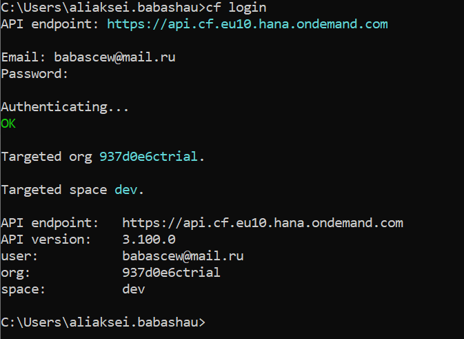

# Pets

## Description

### General description

* A person can have several animals
* Animal can have several owners
* Animals are dogs or cats
* Removing a person leads to the removal of his animals
* Owners can exchange animals

### Maven compile & run commands

```
mvn clean install -P <profile-id>
```  

```
mvn -P<profileId> spring-boot:run
```  

`<profile-id>` it is id of the profile for a build (**dev** or **prod**).

**Example:** `mvn -Pdev spring-boot:run`

## Database

### Jpa layer


### Database layer


## Postman

Test Api by [Postman](docs/postman/Pets%20api.postman_collection.json)

## Cloud

To deploy application

* Register and create trial account
* Download [CF CLI](https://docs.cloudfoundry.org/cf-cli/install-go-cli.html)
* Set **API ENDPOINT** from terminal:  
  ```
  cf api YOUR_CLOUND_FOUNDRY_API_ENDPOINT
  ``` 
  **API Endpoint** in account: 
* Login in your account:  
  ```
  cf api login
  ```
  
* Build a project from **_prod_** profile:  
  ```
  mvn clean install -Pprod
  ```
* Create _manifest.yml_ file in root folder:  
  ```
  ---
  applications:
  - name: pets
    memory: 1024M
    path: target/Pets-0.0.1-SNAPSHOT.jar
    random-route: true
    host: pets-16-05-1996
    buildpacks:
      - sap_java_buildpack
    env:
      SPRING_PROFILES_DEFAULT: prod
  ```
* Push to the cloud:  
  ```
  cf push
  ```
  

* An application has been created and launched in your cloud foundry


