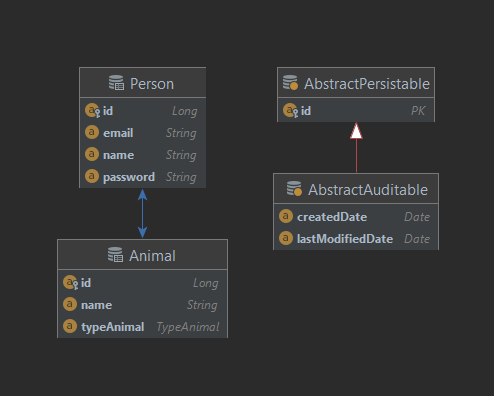

# Pets

## Description

### General description

* A person can have several animals
* Animal can have several owners
* Animals are dogs or cats
* Removing a person leads to the removal of his animals
* Owners can exchange animals

### Maven compile & run commands

```
mvn clean install -P <profile-id>
```  

```
mvn -P<profileId> spring-boot:run
```  

`<profile-id>` it is id of the profile for a build (**dev** or **prod**).

**Example:** `mvn -Pdev spring-boot:run`

## Database

### Jpa layer



### Database layer


## Postman

Test Api by [Postman](docs/postman/Pets%20api.postman_collection.json)

## Cloud

To deploy application

* Register and create trial account
* Download [CF CLI](https://docs.cloudfoundry.org/cf-cli/install-go-cli.html)
* Set **API ENDPOINT** from terminal:  
  ```
  cf api YOUR_CLOUND_FOUNDRY_API_ENDPOINT
  ``` 
  **API Endpoint** in account: 
* Login in your account:  
  ```
  cf api login
  ```
  
* Build a project from **_prod_** profile:  
  ```
  mvn clean install -Pprod
  ```
* Create _manifest.yml_ file in root folder:  
  ```
  ---
  applications:
  - name: pets
    memory: 1G
    disk_quota: 512M
    path: target/Pets-0.0.1-SNAPSHOT.jar
    buildpacks:
    - https://github.com/cloudfoundry/java-buildpack.git#v4.16
    services:
    - pets-db
    env:
      SPRING_PROFILE_DEFAULT: cloud
  ```
* Push to the cloud:  
  ```
  cf push
  ```
  

* An application has been created and launched in your cloud foundry

  
## Connect to database from Idea

* Enable ssh: `cf allow-space-ssg dev`
* Enable ssh to app: `cf enable-ssh <app name>`
* Restart app
* Create ssh tunnel:

```
cf ssh -L <localhost>:<localport>:<hostname>:<port> <app-name>
```
  
**For my project:** 
```
cf ssh -L localhost:9898:postgres-c9bf4bfe-1d17-4e1a-8e2e-0f14b6fd0332.ce4jcviyvogb.eu-central-1.rds.amazonaws.com:2447 pets
```
**Result:**


## Add logs
* Create and bind `logs service` to app
* Add service to manifest:
```
services:
  ...
  - pets-logs
  ...
``` 
* Add depedency to POM file:
```
<dependency>
    <groupId>com.sap.hcp.cf.logging</groupId>
    <artifactId>cf-java-logging-support-logback</artifactId>
    <version>${cf.logback.version}</version>
</dependency>
```
* Add file `src/main/resources/logback-spring.xml`: [logback-spring.xml](src/main/resources/logback-spring.xml)

## Destination 
* Create and bind `destination service` to app
* Add service to manifest: 
```
services:
  ...
  - destination
  ...
```

## Connectivity

* Create and bind `connectivity service` to app
* Add service to manifest:
```
services:
  ...
  - connectivity
  ...
```
* Create file `default-env.json` in root folder and supply the `VCAP_SERVICES`: [default-env.json](default-env.json)
* Add dependency to POM file:
```
<dependency>
  <groupId>com.sap.cds</groupId>
  <artifactId>cds-integration-cloud-sdk</artifactId>
</dependency>
```

* Enable SSH to app: `cf enabled-ssh <app-name>`
* Restart aap: `cf restart <app-name>`
* Create an SSH session:

```
cf ssh <app-name> -L <local-proxy-host><local-proxy-port>:<proxy-host>:<proxy-port>
```
**For my project:**
```
cf ssh pets -L localhost:1234:connectivityproxy.internal.cf.eu10.hana.ondemand.com:20003
```

**Result:**


* Replace the value of the field `VCAP_SERVICES.connectivity.credentials.onpremise_proxy_host` in default-env.json with `localhost`.


## LINK
* For more information about add log look here: [**Logging**](https://sap.github.io/cloud-sdk/docs/java/guides/logging-overview/)
* For more information about connect destination service look here: [**Use Destinations To Connect To Other Systems and Services**](https://sap.github.io/cloud-sdk/docs/java/features/connectivity/sdk-connectivity-destination-service).

